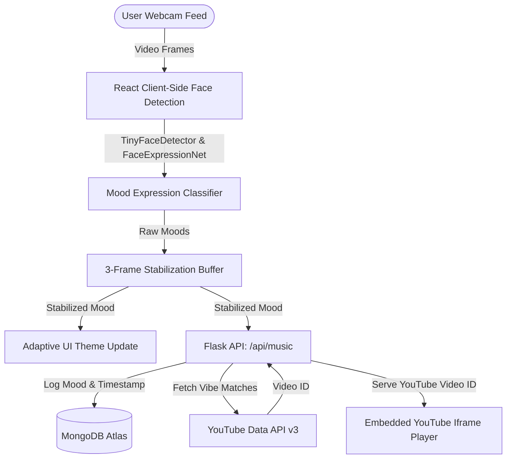

# 🎵 MoodTune

**MoodTune** is a real-time, AI-powered music recommendation web application. By utilizing your device's webcam, the application uses deep learning models to analyze your facial expressions, detect your current mood, and automatically curate and play matching music via the YouTube player. 

The application is structured as a decoupled full-stack project, featuring a **React (Vite)** frontend powered by client-side face recognition and a **Flask** backend integrating the YouTube Data API and MongoDB for mood logging.

---

## 🏗️ Architecture & Flow

The system operates via a continuous feedback loop between the client's webcam feed, the face detection models, the backend recommendation engine, and external APIs.



---

## ✨ Features

- **Real-Time Client-Side Emotion Detection**: Uses `face-api.js` running directly in the browser to analyze expressions without sending heavy video frames to the server.
- **3-Frame Stabilization Buffer**: Implements a custom sliding-window buffer in the React hook to filter out momentary tracking glitches and smooth transitions between emotions.
- **Adaptive Ambient UI**: The visual theme (buttons, badges, borders, typography accents) automatically morphs using smooth CSS transitions matching the color scheme of the detected mood:
  - 😄 **Happy**: Warm Gold (`#f2b705`)
  - 😢 **Sad**: Deep Blue (`#4a7fe0`)
  - 😠 **Angry**: Vivid Red (`#e5484d`)
  - 😐 **Neutral**: Soft Violet (`#a78bfa`)
  - 😲 **Surprised**: Vibrant Pink (`#e5399d`)
- **Smart YouTube Recommendations**: Queries the YouTube API for trending tracks matching the vibe. If the API key is not present or limit is exceeded, it gracefully falls back to predefined mood playlists.
- **Persistent Mood Auditing**: Every mood request is logged asynchronously to a MongoDB Atlas cluster to store usage analytics over time.

---

## 📂 Project Structure

```text
MoodTune/
├── backend/
│   ├── app.py             # Flask API & database connection
│   ├── .env               # Backend environment variables
│   └── venv/              # Python virtual environment
└── frontend/
    ├── src/
    │   ├── components/
    │   │   ├── MoodBadge.jsx     # Current mood display chip
    │   │   ├── WebcamView.jsx    # Styled webcam feed & circular border animation
    │   │   └── YouTubePlayer.jsx # Responsive embedded YouTube iframe player
    │   ├── hooks/
    │   │   └── useFaceDetection.js # Custom hook wrapping face-api.js & buffer logic
    │   ├── App.jsx        # Main component layout
    │   └── main.jsx       # Client entry point
    ├── public/
    │   └── models/        # Pre-trained CNN weights for face expression detection
    ├── package.json       # Node package manager configuration
    └── vite.config.js     # Vite configuration
```

---

## 🛠️ Installation & Local Setup

### Prerequisites
- **Node.js** (v18+ recommended)
- **Python** (v3.10+ recommended)
- **MongoDB Cluster** (optional, for logs)
- **YouTube Data API v3 Key** (optional, falls back to local tracks if not provided)

---

### 1. Backend Configuration
1. Navigate to the backend directory:
   ```bash
   cd backend
   ```
2. Create and activate a Python virtual environment:
   ```bash
   python3 -m venv venv
   source venv/bin/activate  # On Windows: venv\Scripts\activate
   ```
3. Install dependencies:
   ```bash
   pip install flask flask-cors pymongo dnspython requests python-dotenv certifi
   ```
4. Create a `.env` file in the `backend/` directory:
   ```env
   YOUTUBE_API_KEY=your_youtube_api_key_here
   MONGODB_URI=your_mongodb_connection_string_here
   ```
5. Run the server:
   ```bash
   python app.py
   ```
   The backend will start at `http://localhost:5000`.

---

### 2. Frontend Configuration
1. Navigate to the frontend directory:
   ```bash
   cd ../frontend
   ```
2. Install the node packages:
   ```bash
   npm install
   ```
3. Create a `.env.local` (or configure `.env.production`) file:
   ```env
   VITE_API_URL=http://localhost:5000
   ```
4. Run the development server:
   ```bash
   npm run dev
   ```
   Open your browser to the URL displayed (usually `http://localhost:5173`).

---

## 🔌 API Endpoints

### 1. Get Recommendation
* **Endpoint:** `GET /api/music`
* **Query Params:** `mood` (values: `happy`, `sad`, `angry`, `neutral`, `surprised`)
* **Response:**
  ```json
  {
    "videoId": "ZbZSe6N_BXs",
    "source": "youtube"  // or "fallback"
  }
  ```

### 2. Get Mood Logs
* **Endpoint:** `GET /api/logs`
* **Response:** Returns the last 20 logged mood timestamps.
  ```json
  [
    {
      "mood": "happy",
      "timestamp": "2026-07-16T18:40:00.000Z"
    }
  ]
  ```

### 3. Service Health
* **Endpoint:** `GET /api/health`
* **Response:**
  ```json
  {
    "mongodb": true,
    "status": "ok"
  }
  ```

---

## 🧩 Details on Core Algorithms

### The Stabilization Buffer
To ensure a pleasant UX, we avoid rapid flickering of music requests due to sudden micro-expressions. The `useFaceDetection` hook maintains a `stabilizationBuffer` consisting of the last 3 detected frames:
1. Every 700ms, the face detector captures a new expression.
2. The expression is pushed into a FIFO queue of max length 3.
3. The hook calculates the **mode** (most frequent expression) of the buffer.
4. Only when the mode changes is the application's mood state updated, triggering a new API call to find matching music.
